# Notifi-iOSApp
Notifi-iOSApp
<h1 align="center">🔔 Notifi - iOS App</h1>

<p align="center">
  
  
  
  
  
</p>

**Notifi** is a lightweight iOS app that showcases the power and flexibility of **local notifications**. Whether you're testing notification behavior, demonstrating scheduling logic, or learning how to manage alerts on iOS, **Notifi** provides an intuitive interface to simulate and control notifications efficiently.

---

## ✨ Features:

- 🕒 **Schedule Notification**  
  Easily schedule a single local notification to appear after a delay.

- 📱 **Simulate Background Mode**  
  Emulate background execution to test notification delivery timing.

- 🔢 **Send Multiple Notifications**  
  Prompt the user for a number (1–10) and instantly schedule that many local notifications.

- 🔁 **Send Sequential Notifications**  
  Automatically send a series of counter-based notifications one after the other.

- 🔔 **Custom Notification Sounds**  
  Each notification can play a different audio file to distinguish between alerts.

- 🔢 **Dynamic Badge Count**  
  Notifications can increment the app’s badge icon dynamically, indicating unseen alerts.

- 🧹 **Reset Notifications**  
  Cancel all pending notifications and clear badge count and delivered alerts.

- 🎨 **Clean SwiftUI Interface**  
  Built entirely using **SwiftUI** for a smooth, modern, and minimal design.

---

## 🛠️ Installation:

To run this project locally:

1. Clone the repository:
    ```bash
    git clone https://github.com/deepanshubajaj/Notifi-iOSApp.git
    ```

2. Open the project in Xcode:
    ```bash
    open Notifi.xcodeproj
    ```

3. Build and run the app on a simulator or physical device.

> Make sure you have Xcode installed and configured properly to run the project.

---

## 🛠 Technologies Used:

- 🛠️ **SwiftUI** — Used for designing the user interface.  
- 🧪 **Xcode** — Used for development, testing, and debugging.   
- 💻 **Swift** — The core programming language powering the app.

---

## 🎨 App Look:

<p align="center">
  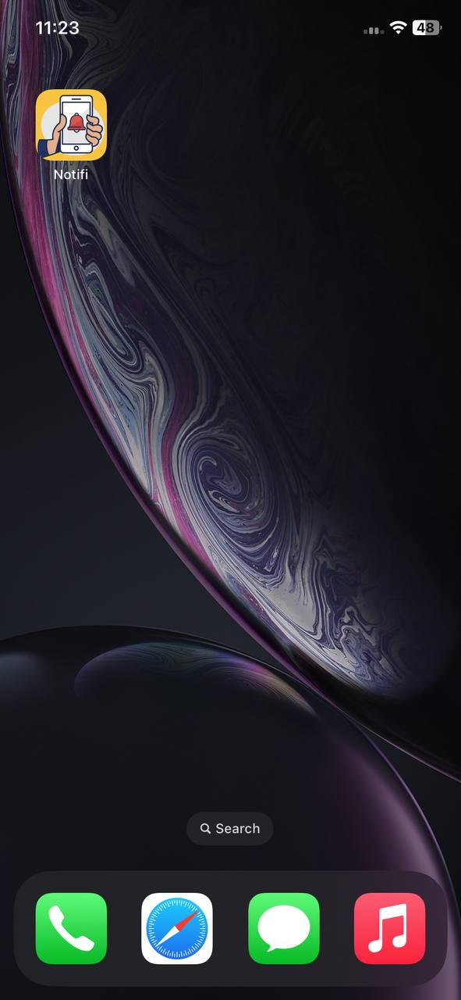
</p>
<p align="center">
  *App snapshot in the simulator.*
</p>

---

## 🖼️ Screenshots:

<p align="center">
  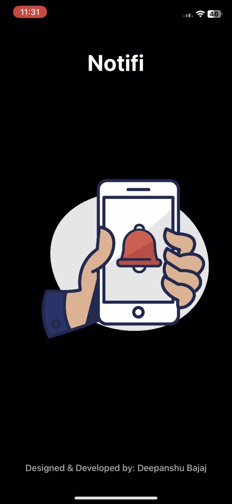
</p>

<p align="center">
  
  
  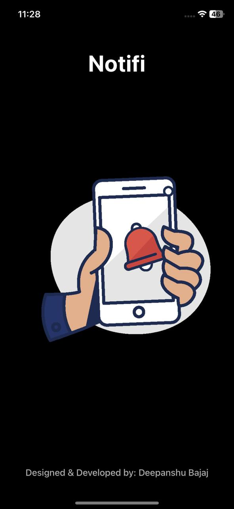
</p>

<p align="center">
  *Splash screen displayed upon app launch.*
</p>


##


<p align="center">
    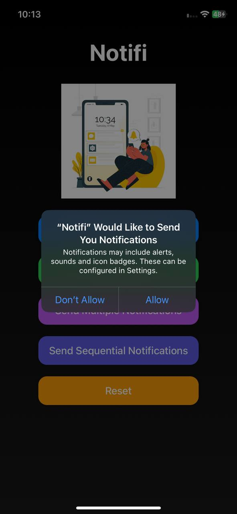
    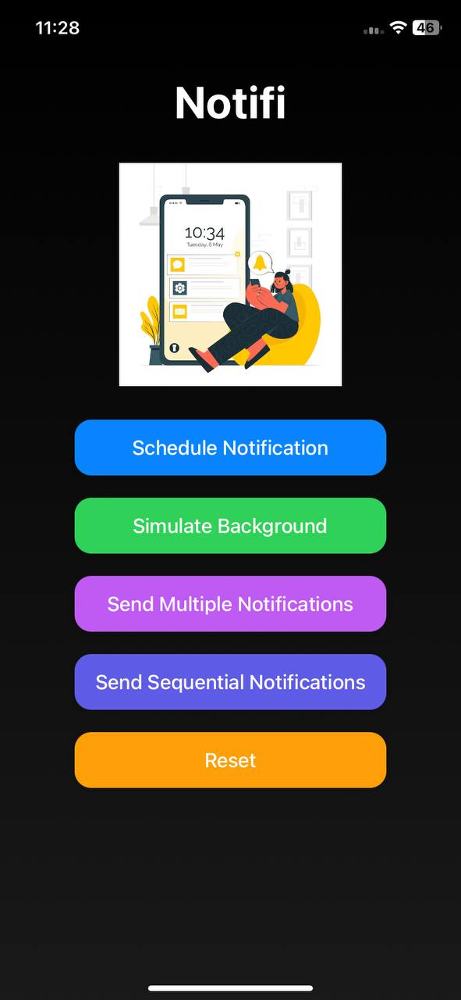
    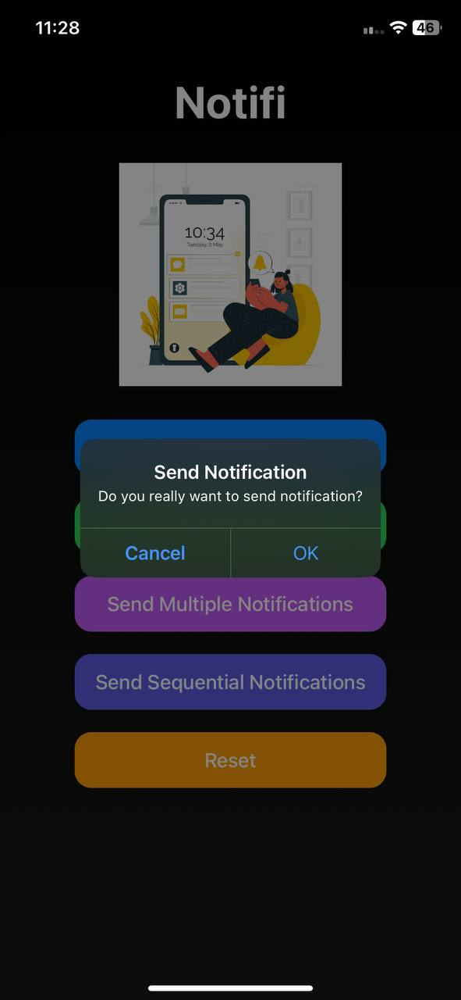
</p>

##

<p align="center">
    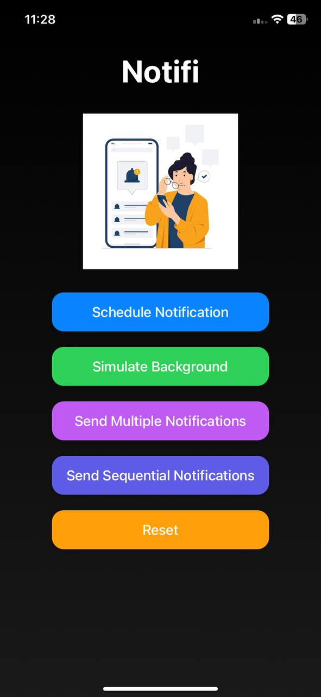
    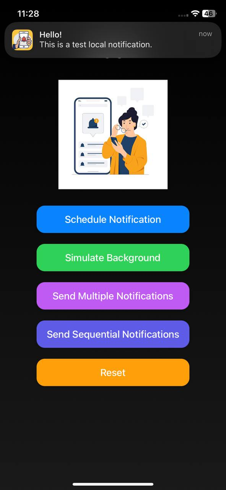
    
</p>

##

<p align="center">
    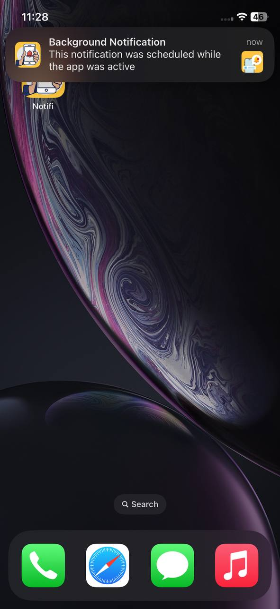
    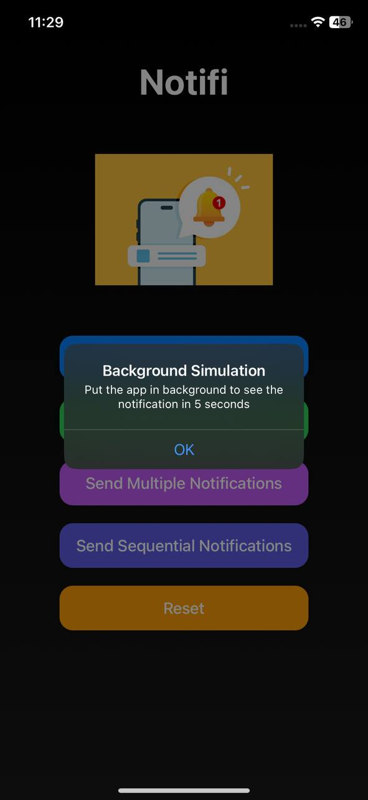
    
</p>

##

<p align="center">
    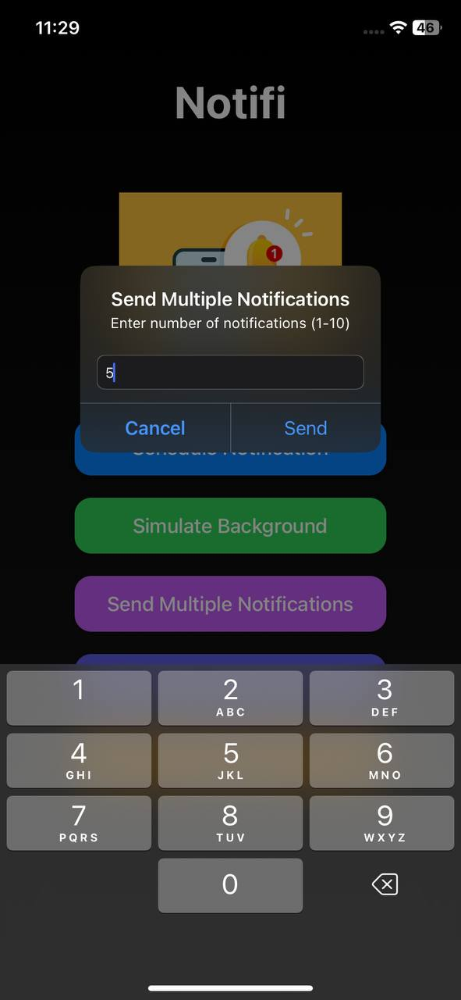
    
    
</p>

##

<p align="center">
    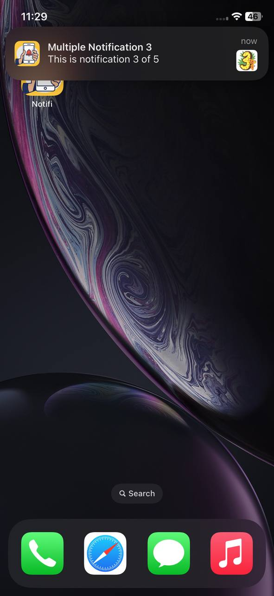
    
    
</p>

##

<p align="center">
    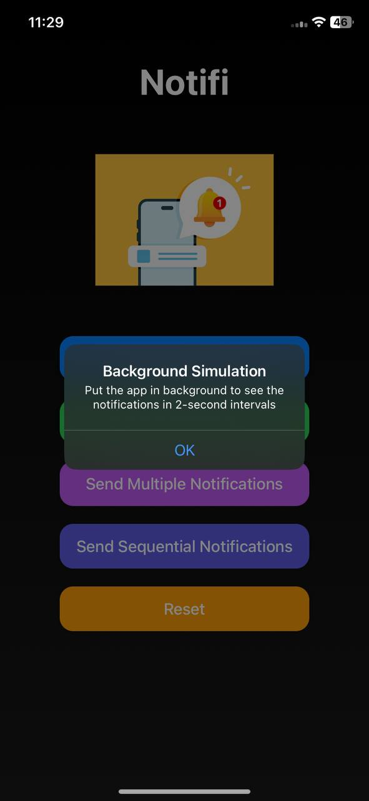
    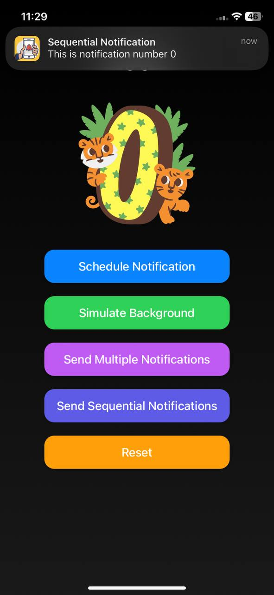
    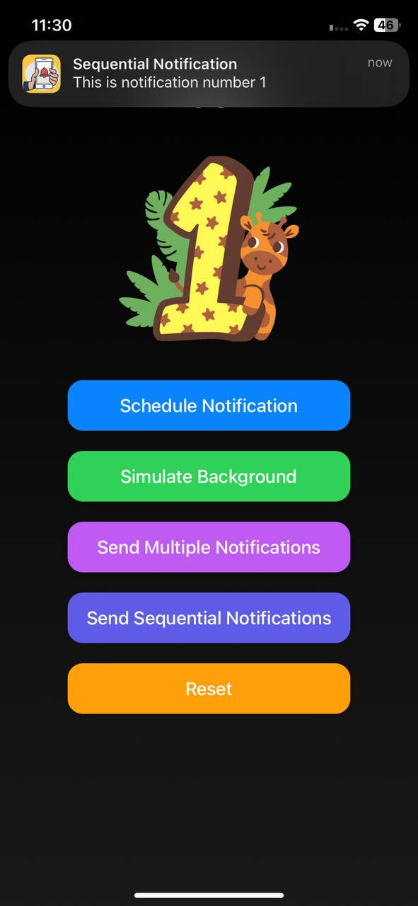
</p>

##

<p align="center">
    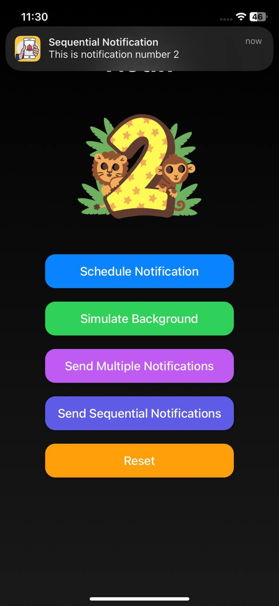
    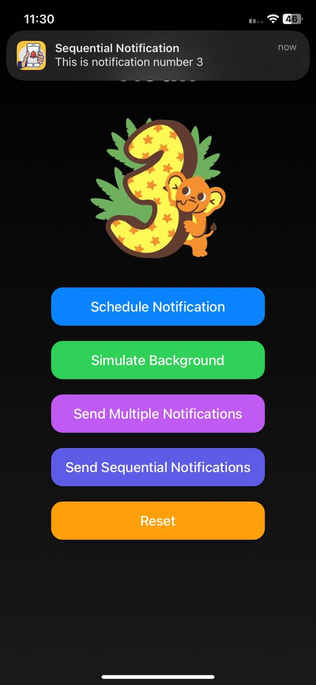
    
</p>

<p align="center">
  *Screenshots of the Notifi App showing different screens*
</p>

---

## 📱 App Icon:

<p align="center">
  
</p>
<p align="center">
  *The app icon reflects the Notifi look*
</p>

---

## 🚀 Video Demo:

Here’s a short video showcasing the app's functionality:

<p align="center">
  
  
</p>

➤ <a href="ProjectOutputs/WorkingVideo/SplashScreen.mp4">🎬 Watch Splash Screen Video</a>

➤ <a href="ProjectOutputs/WorkingVideo/workingVideo1.MP4">🎥 Watch Working Video 1</a>

➤ <a href="ProjectOutputs/WorkingVideo/workingVideo2.MP4">🎥 Watch Working Video 2</a>

---

## 🤝 Contributing

Thank you for your interest in contributing to this project!  
I welcome contributions from the community.

- You are free to use, modify, and redistribute this code under the terms of the **Apache-2.0 License**.
- If you'd like to contribute, please **open an issue** or **submit a pull request**.
- All contributions will be reviewed and approved by the author — **[Deepanshu Bajaj](https://github.com/deepanshubajaj?tab=overview&from=2025-03-01&to=2025-03-31)**.

---

### 📌 How to Contribute

To contribute:

1. Fork the repository.

2. Create a new branch:
   ```bash
    git checkout -b feature/your-feature-name
   ```

3. Commit your changes:
   ```bash
    git commit -m 'Add your feature'
   ```

4. Push to the branch:
   ```bash
    git push origin feature/your-feature-name
   ```

5. Open a pull request.

---

## 📃 License

This project is licensed under the [Apache-2.0 License](./LICENSE).  
You are free to use this project for personal, educational, or commercial purposes — just make sure to provide proper attribution.

> **Clarification:** Commercial use includes, but is not limited to, use in products,  
> services, or activities intended to generate revenue, directly or indirectly.